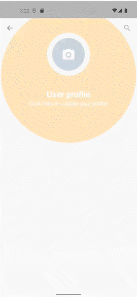
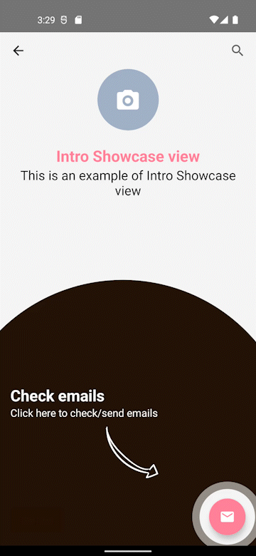
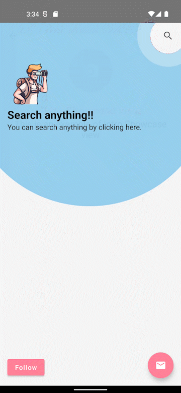
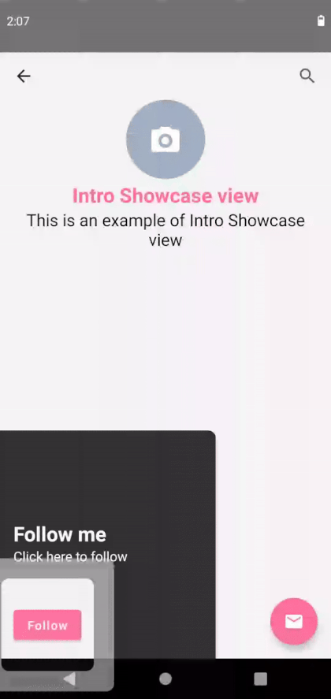

# Intro Showcase View
[]( https://android-arsenal.com/details/1/8387 )


An android library to highlight different features of the app built using Jetpack Compose.

The library is inspired by the [TapTargetView](https://github.com/KeepSafe/TapTargetView) that is useful for legacy views.




## Configuration

Available on [Maven Central](https://search.maven.org/artifact/com.canopas.intro-showcase-view/introshowcaseview).

Add the dependency
```gradle
implementation 'com.canopas.intro-showcase-view:introshowcaseview:<latest-version>'
```

## How to use ?
```kotlin
@Composable
fun ShowcaseSample() {
    var showAppIntro by remember {
        mutableStateOf(true)
    }
    
    IntroShowcase(
        showIntroShowCase = showAppIntro,
        dismissOnClickOutside = false,
        onShowCaseCompleted = {
            //App Intro finished!!
            showAppIntro = false
        },
    ) {
        FloatingActionButton(
            onClick = {},
            modifier = Modifier.introShowCaseTarget(
                index = 0,
                style = ShowcaseStyle.Default.copy(
                    backgroundColor = Color(0xFF1C0A00), // specify color of background
                    backgroundAlpha = 0.98f, // specify transparency of background
                    targetCircleColor = Color.White // specify color of target circle
                ),
                // specify the content to show to introduce app feature
                content = {
                    Column {
                        Text(
                            text = "Check emails",
                            color = Color.White,
                            fontSize = 24.sp,
                            fontWeight = FontWeight.Bold
                        )
                        Text(
                            text = "Click here to check/send emails",
                            color = Color.White,
                            fontSize = 16.sp
                        )
                        Spacer(modifier = Modifier.height(10.dp))
                        Icon(
                            painterResource(id = R.drawable.right_arrow),
                            contentDescription = null,
                            modifier = Modifier
                                .size(80.dp)
                                .align(Alignment.End),
                            tint = Color.White
                        )
                    }
                }
            ),
            backgroundColor = ThemeColor,
            contentColor = Color.White,
            elevation = FloatingActionButtonDefaults.elevation(6.dp)
        ) {
            Icon(
                Icons.Filled.Email,
                contentDescription = "Email"
            )
        }
    }
}
```
 

## How to add custom reveal shape ?

For adding a custom reveal shape like a circle, rectangle, or any other shape, you can pass the custom shape to the `revealShape` parameter of `ShowcaseStyle` class.
```kotlin
introShowCaseTarget(
    index = 3,
    style = ShowcaseStyle.Default.copy(
        revealShape = RevealShape.Rounded(cornerRadius = 25f)
    ),
    content = {
        Column {
            Text(
                text = "Follow me",
                color = Color.White,
                fontSize = 24.sp,
                fontWeight = FontWeight.Bold
            )
            Text(
                text = "Click here to follow",
                color = Color.White,
                fontSize = 16.sp
            )
        }
    },
)
```


# Demo
[Sample](https://github.com/canopas/compose-intro-showcase/tree/master/app) app demonstrates how simple the usage of the library actually is.

# Interested in library implementation?
Checkout the [Article](https://blog.canopas.com/intro-showcase-view-in-jetpack-compose-ac044cd3bf28)

# Bugs and Feedback
For bugs, questions and discussions please use the [Github Issues](https://github.com/canopas/compose-intro-showcase/issues).

# Credits

Intro showcaseview is owned and maintained by the [Canopas team](https://canopas.com/). You can follow them on Twitter at [@canopassoftware](https://twitter.com/canopassoftware) for project updates and releases.
